# Episode 1 - The Blind Bot

## Introduction

If you have gone through the content of Week 0 and tried the problem, you should be familiar with the basic ideas of ROS. In addition, you should be capable of creating a simple publisher and a subscriber. If so, you are ready to face what is about to come your way. In this episode, you will see how to work in **Gazebo** and **Rviz**. 


 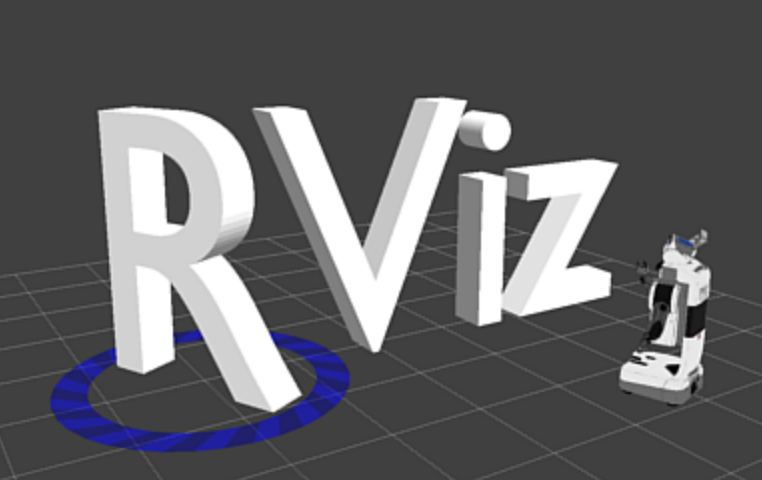

You will also get to play with the **TurtleBot3** in Gazebo and see the working of its sensors in Rviz.

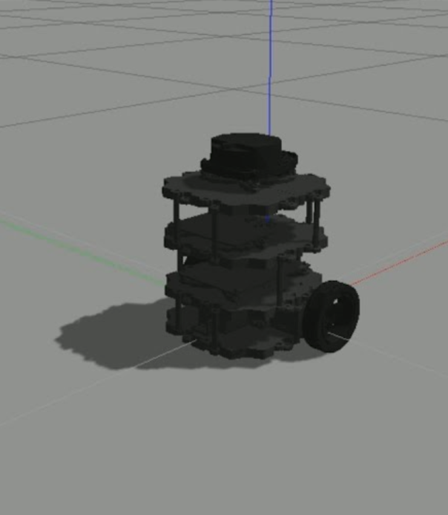

Let's begin !

## Table of Contents

<ol>
  <li><a href="#Gazebo">Gaze at Gazebo ...</a></li>
  <li><a href="#Rviz">Viziting Rviz ...</a></li>
  <li><a href="#Turtlebot3">The TurtleBot3 emerges ...</a></li>
</ol>

## Initial preparation

Create a package ```epi1``` in ```catkin_ws```, with ```scripts```,```launch```, ```worlds``` and ```configs``` folders. This will be required for storing the various files that will be created throughout.

## Gaze at Gazebo ... <a name="Gazebo"></a>


### What is it ?

Gazebo is a **robotics simulator** that is capable of simulating **dynamical systems** in various **realistic scenarios and environments**. 
This is useful for testing algorithms and designing robots before actually implementing in the real physical world.


### Starting Gazebo

If you have successfully installed ROS , Gazebo should already be installed

Launch Gazebo by executing the following command

```
gazebo
```
Upon execution, the following screen should appear.


Welcome to Gazebo !

### Basic features

Refer to the following link to know about the basic GUI features of Gazebo.

[Understanding the GUI](http://gazebosim.org/tutorials?cat=guided_b&tut=guided_b2)

### Create a World in Gazebo

Let's look at the creation of a new simple world by creating ```wall.world```

1. Open Gazebo
2. Add a **Box** by selecting the Box icon in the **Upper Toolbar** and clicking on the desired location in the scene where it needs to be placed.

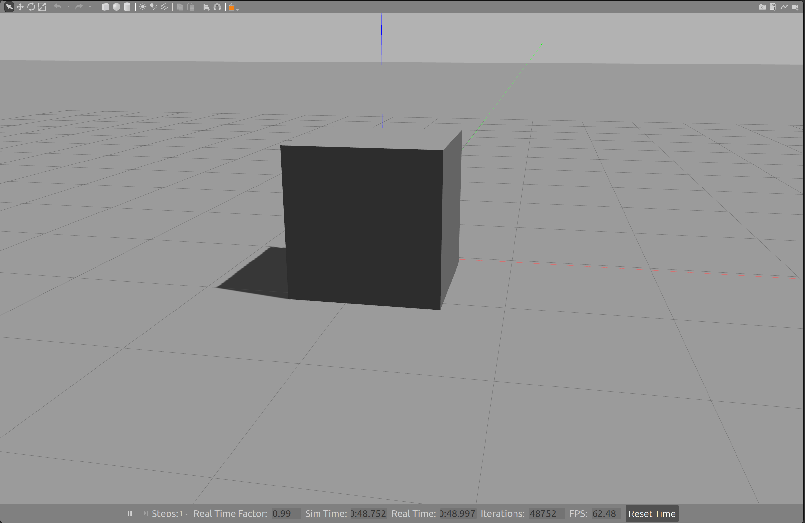

3. Use the **Scale** tool (Shortcut - ```S```) to scale down the box along one of the axes and scale up along another axis

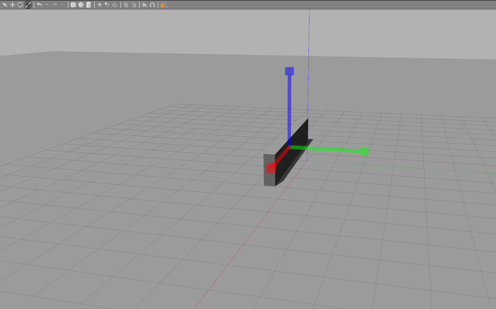

4. Use ``` Ctrl + C``` to copy the side of the wall and ```Ctrl + V``` to paste and place it at the desired location.

5. Use the **Translation** tool (Shortcut - ```T```) to move the sides of the wall to the desired location if needed  and **Rotate** tool (Shortcut - ```R```) to adjust their orientation. One may also adjust the position and orientation using the **pose settings** as well.

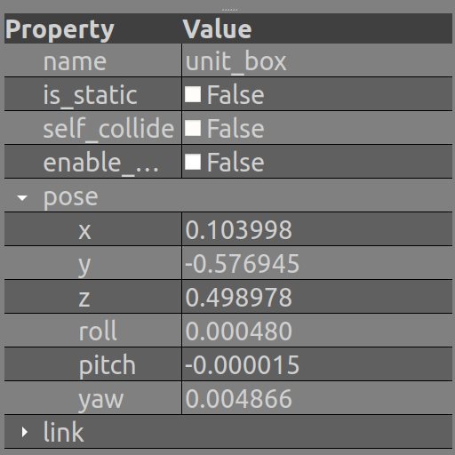

The wall has been created.

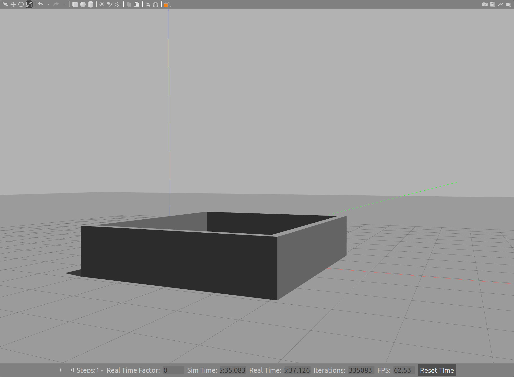


### Saving and Loading worlds

To save a world,

1. Go to **File > Save World As (Ctrl + Shift + S)**
  
2. Go to the appropriate folder (```epi1 > worlds```), give an appropriate name (```wall```) and save
 
 
To load the world,

1. ```cd``` to the directory containing the world file (```worlds``` in this case) in the terminal
  
2. Execute  ```gazebo wall```
 
 
**Optional Reading**-[Building a world](http://gazebosim.org/tutorials?cat=build_world)

### Modifying worlds

1. One way to modify the world just created is to open the world in Gazebo, make the necessary changes and overwrite the existing world file by re-saving in the same fashion as described in the previous section.

2. Another way to modify the world is by modifying the **sdf/world file** generated. 

Let us look at an example by changing the colour of the walls to **Red** and making the walls **static**. Navigate to the ```worlds``` folder and open the ```wall.world``` file.

To change the color of the side of the wall named ```unit_box```, alter the ```<name>``` to ```Gazebo/Red``` under the  ```<material>``` tag below ```<model name='unit_box'>```, 

To make ```unit_box``` static, add ```<static> 1 </static>``` below  ```<model name='unit_box'>```

Perform the above steps for the other sides of the wall.

Save the file and load it in Gazebo. The modified world should be visible.

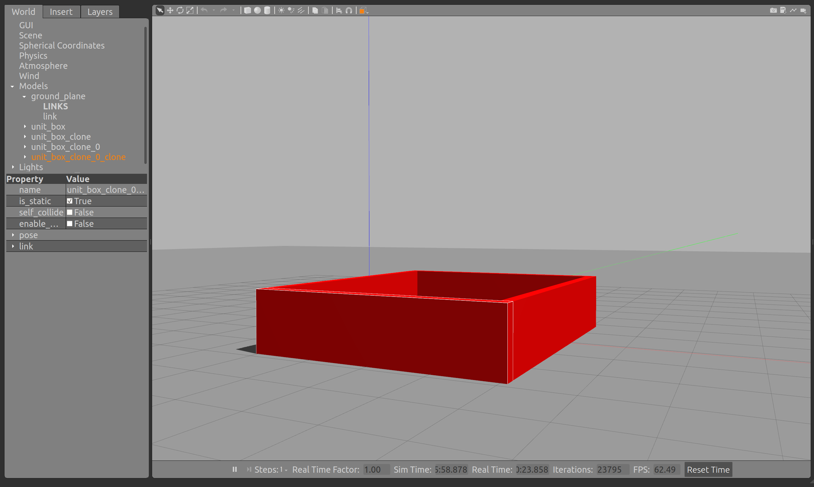


### Starting Gazebo with Launch files

Create ```custom_gazebo.launch``` in the ```launch``` folder

Add the following code to launch Gazebo with ```wall.world```

```
<launch>
<include file="$(find gazebo_ros)/launch/empty_world.launch">
    <arg name="world_name" value="$(find epi1)/worlds/wall"/>
    <arg name="paused" value="false"/>
    <arg name="use_sim_time" value="true"/>
    <arg name="gui" value="true"/>
    <arg name="headless" value="false"/>
    <arg name="debug" value="false"/>
</include>
</launch>

```
On executing  ```roslaunch epi1 custom_gazebo.launch```, Gazebo will be launched with the desired world.

## Viziting Rviz ... <a name="Rviz"></a>

### What is it ?

Rviz is a **3D visualizer** for **ROS** that lets us view a lot about the **sensing**, **processing** and **state** of a robot.
This makes the **development** of robots easier and also enables us to **debug** more efficiently (better than looking at numbers on a terminal :P)

### What is the difference between Rviz and Gazebo ?

Rviz is a **visualizer** i.e it shows what the robot **perceives** is happening while Gazebo is a **simulator** i.e. it shows what is **actually** happening.

Consider the scenario in which we do not have physical hardware-based robots. In that case we would use a simulator like Gazebo to know what would actually happen and the data from the sensors can be visualized in a visualization tool like Rviz. In case we have physical robots, then the data from the sensors can still be visualized in Rviz, but we do not need a simulator necessarily.

### Installation

Execute the following command

```
sudo apt-get install ros-<Version>-rviz
```
Version = ```kinetic```, ```melodic```, ```noetic```

### Starting Rviz

Ensure that ```roscore``` is running in a separate tab. Then execute the following command,

```
rosrun rviz rviz
```
Upon execution, the following screen should appear.


Welcome to Rviz !

### Basic features


1. **Displays** - These are entities that can be "displayed"/ represented/visualized in the world like **point cloud** and **robot state**

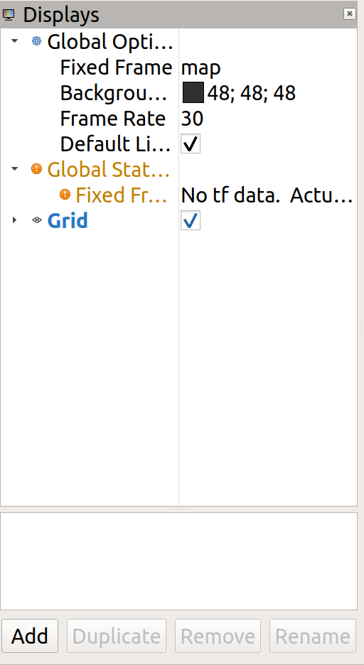

Using the **Add** button, we can add additional displays.

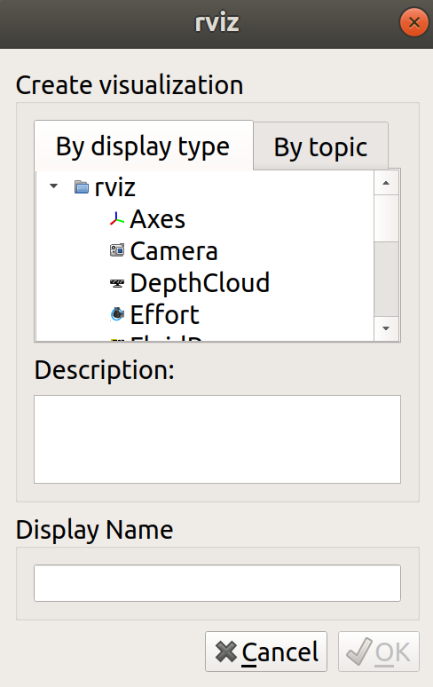


2. **Camera types** - These are ways of viewing the world from different angles and projections.

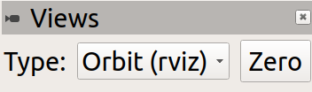

3. **Configurations** - These are combinations of displays, camera types, etc that define the overall layout of what and how the visualization is taking place in the rviz window.

### Saving and Loading configurations

Currently the default layout of the Rviz window is similar to the picture below

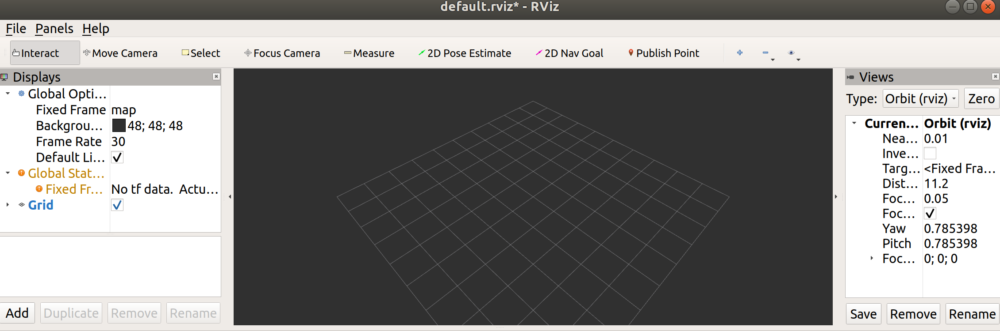

Say we are interested in saving a configuration consisting of additional displays such as LaserScan as well as a different camera type. How do we accomplish that ?

1. Add the required displays and change the camera type

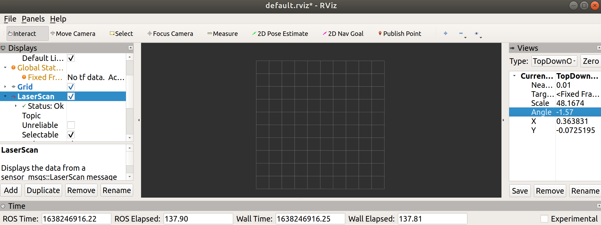

2. To save the configuration,

    2.1) Go to **File > Save Config As (Ctrl + Shift + S)**
  
    2.2) Go to the appropriate folder (```epi1 > configs```), give an appropriate name (```custom```) and save

3. To load the configuration at a later time,

    3.1) Go to **File > Open Config (Ctrl + O)**
  
    3.2) Go to the appropriate folder (```epi1 > configs```) and select the config file (```custom```)
   

### Starting Rviz through Launch files

Create ```custom_rviz.launch``` in the ```launch``` folder

Add the following code to launch Rviz with ```custom.rviz``` configuration

```
<launch>
<!-- Format of args = "-d $(find package-name)/relative path"-->
<node name="custom_rviz" pkg="rviz" type="rviz" args="-d $(find epi1)/configs/custom.rviz"/>
</launch>
```

On executing  ```roslaunch epi1 custom_rviz.launch```, Rviz will be launched with the desired configuration.

## The TurtleBot3 emerges ... <a name="Turtlebot3"></a>

TurtleBot3 is the third version of the TurtleBot, which is a ROS standard platform robot for use in education and research. It is available in hardware form as well as in a simulated format. We shall be using the simulated format obviously.

TurtleBot3 comes in 3 different models - Burger, Waffle and Waffle-Pi

## Installing TurtleBot3

To install the TurtleBot3, execute the following command

```
sudo apt-get install ros-<ROS Version>-turtlebot3-*

```
ROS Version = ```melodic```, ```noetic```

After the above step, we need to set a **default TurtleBot3 Model** by executing the following command.

```
echo "export TURTLEBOT3_MODEL=<Model>" >> ~/.bashrc
```
Model = ```burger```,```waffle```,```waffle_pi```

We shall stick to ```burger``` for the time being.

Close the terminal.

For greater clarity, you may refer the following link.

[Installing Turtlebot3](https://emanual.robotis.com/docs/en/platform/turtlebot3/quick-start/#pc-setup)

Henceforth, the **TurtleBot3** may be referred to as **bot** simply, unless specified.

Let us see the bot in action in Gazebo !

## Launching TurtleBot3 in Gazebo

To summon the bot in an **empty world** in **Gazebo**, execute the following command in a new terminal.

```
roslaunch turtlebot3_gazebo turtlebot3_empty_world.launch
```

Upon execution, the following screen should be visible.

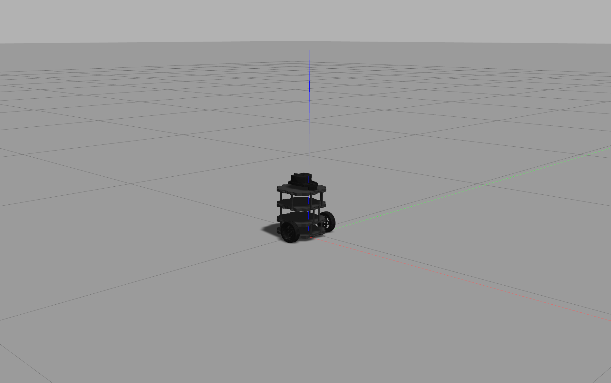

Alternatively, to summon the bot in the **standard environment** in  **Gazebo**, execute the following command.

```
roslaunch turtlebot3_gazebo turtlebot3_world.launch
```

Upon execution, the following screen should be visible.

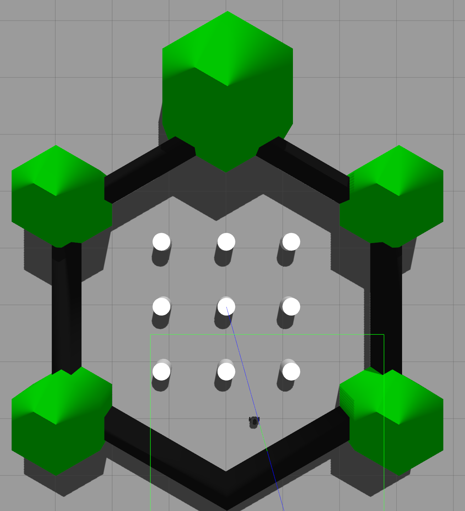

## Visualizing in Rviz

After launching the bot in Gazebo, to visualize it in **Rviz**, run the following command in a separate tab

```
roslaunch turtlebot3_gazebo turtlebot3_gazebo_rviz.launch
```

If the bot is in the standard world, you should be able to see the **point cloud** representing the objects detected by the bot. Amazing !

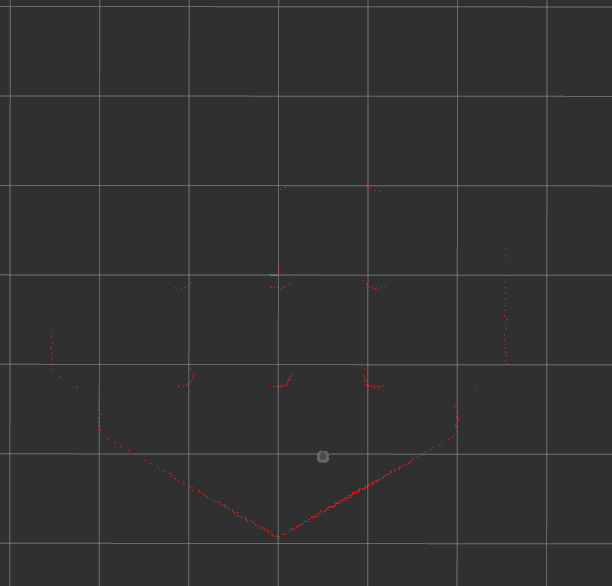

## Taking a peek at the TurtleBot3 topics

After launching the TurtleBot3 (Burger model) in Gazebo, execute ```rostopic list``` in another tab.

The expected output is as follows
```
/clock
/cmd_vel
/gazebo/link_states
/gazebo/model_states
/gazebo/parameter_descriptions
/gazebo/parameter_updates
/gazebo/set_link_state
/gazebo/set_model_state
/imu
/joint_states
/odom
/rosout
/rosout_agg
/scan
/tf
```
We are able to see some of the important topics such as ```/cmd_vel``` and ```/scan```, which will be used later.

## Investigation 1

Launch the **Waffle** model of TurtleBot3 in Gazebo and look at the topics. Anything surprising ? Are you able to figure out a connection with the title of the episode ?


## Moving the bot around

Let's move the bot around in the standard world in Gazebo using the ```turtlebot3_teleop``` package

The Turtlebot3 is a **differential drive** bot and its motion is described by its **linear velocity** and **angular velocity**. The ratio of the instantaneous linear velocity to the instantaneous angular velocity gives the **radius of curvature** of the arc it traverses at the instant.

On executing the command below,

```
rosrun turtlebot3_teleop turtlebot3_teleop_key
```
we get the ability to control the linear velocity and the angular velocity of the bot using the appropriate keys as displayed on the screen.

**w** - Increase linear velocity

**x** - Decrease linear veocity

**a** - Increase angular velocity

**d** - Decrease angular velocity

**s** - Stop

One might quickly realize that moving the bot with the keys is kind of annoying.

Let's see another way of moving the bot around using a publisher that will publish velocity commands to the ```/cmd_vel``` topic. For simplicity, we shall make it go with a constant speed in a circular path to give the basic idea.

#### Knowing the message type

How do we know the type of message that needs to be published into ```/cmd_vel``` ? Well, on launching the bot in Gazebo, execute the following command in a new tab

``` rostopic type /cmd_vel ```

The expected output is ```geometry_msgs/Twist```

To inspect the nature of this message type, execute the following command

``` rostopic type /cmd_vel | rosmsg show ```

The expected output is

```
geometry_msgs/Vector3 linear
  float64 x
  float64 y
  float64 z
geometry_msgs/Vector3 angular
  float64 x
  float64 y
  float64 z
```


Once we know the features of the message we are dealing with, we can proceed with writing the code.
Create a python file ```bot_move.py``` in the ```scripts``` folder of ```epi1``` 

```python
#! /usr/bin/env python

import rospy

# rosmsg type gives output of the form A/B
# The corresponding import statement will be 'from A.msg import B'

from geometry_msgs.msg import Twist 

def move():
    rospy.init_node('bot_move',anonymous=True)
    pub=rospy.Publisher('/cmd_vel',Twist,queue_size=10)

    r = rospy.Rate(10)

    vel_cmd = Twist()

    vel_cmd.linear.x = 0.1  #The bot's heading direction is along the x-axis in its own reference frame
    vel_cmd.angular.z = 0.5

    while not rospy.is_shutdown():
        pub.publish(vel_cmd)
        r.sleep()

if __name__=='__main__':
    try:
        move()
    except rospy.ROSInterruptException:
        pass

```
After saving the file, remember to make it executable.

On executing  ```rosrun epi1 bot_move.py``` in a different tab, the bot begins to move along a circular path. Cool !

## Sensing the surroundings

Moving around is not that great unless the bot is also aware of its surroundings, hence it becomes important to be able to utilize the data from its sensors such as **LaserScan**. Let's create a subscriber that will subscribe to the ```/scan``` topic to obtain the distances of the nearest obstacles at different angles with respect to the heading of the bot.

We can determine the message type that is being published into ```/scan``` like how it was determined for ```/cmd_vel```. 

Create a python file ```bot_sense.py``` in the ```scripts``` folder of ```epi1```

```python
#! /usr/bin/env python

import rospy
from sensor_msgs.msg import LaserScan

def read(data):
    theta_min = data.angle_min  # minimum angle in the field of detection
    theta_max = data.angle_max  # maximum angle in the field of detection
    R = data.ranges #Array containing the distances for different values of angle 
    l = len(R) #length of the array R

    # R[0] corresponds to the distance at theta_min
    # R[l-1] corresponds to the distance at theta_max
    # Intermediate entries correspond to the distances at intermediate angles

    print([R[0], R[l-1]])

if __name__=="__main__":
    rospy.init_node('bot_sense')
    rospy.Subscriber('/scan',LaserScan,read)
    rospy.spin()
    
```

    
On executing ```rosrun epi1 bot_sense.py``` in a different tab, we should be able to see a continuous feed of sensor readings on the terminal screen.

Move the bot around by running ```bot_move.py``` as well. What do you see ?

Try printing out ```theta_min```,```theta_max```,```l``` and other variables to get a better understanding of the features of the message.


At this point, the bot must be feeling lonely roaming all by itself. Let us bring a friend to the world. Even a high-functioning sociopath needs one :D 

## Investigation 2

Take a look at the code in ```turtlebot3_world.launch```, ```turtlebot3_gazebo_rviz.launch``` and ```turtlebot3_remote.launch```. It will be helpful for the upcoming sections as the commands in these files will be used more or less directly with slight modification to launch the bots.


To view the code in ```turtlebot3_world.launch```, execute the following commands one after another

```
roscd turtlebot3_gazebo
cd launch
code turtlebot3_world.launch
```

For ```turtlebot3_gazebo_rviz.launch```,

```
roscd turtlebot3_gazebo
cd launch
code turtlebot3_gazebo_rviz.launch
```

For ```turtlebot3_remote.launch```,

```
roscd turtlebot3_bringup
cd launch
code turtlebot3_remote.launch
```


## Summoning Multiple bots in Gazebo

### Launch file

Create a file ```2bots.launch``` in the ```launch``` folder of ```epi1```

Add the following code to the file.

```xml
<launch>
  
  <include file="$(find gazebo_ros)/launch/empty_world.launch">
    <arg name="world_name" value="$(find turtlebot3_gazebo)/worlds/turtlebot3_world.world"/>
    <arg name="paused" value="false"/>
    <arg name="use_sim_time" value="true"/>
    <arg name="gui" value="true"/>
    <arg name="headless" value="false"/>
    <arg name="debug" value="false"/>
  </include>

  <group ns="sherlock">

    <arg name="model" default="waffle" doc="model type [burger, waffle, waffle_pi]"/>
    <arg name="x_pos" default="-0.5"/>
    <arg name="y_pos" default="-0.5"/>
    <arg name="z_pos" default="0.0"/>

    <param name="robot_description" command="$(find xacro)/xacro $(find turtlebot3_description)/urdf/turtlebot3_$(arg model).urdf.xacro " />

    <node pkg="gazebo_ros" type="spawn_model" name="spawn_urdf"  args="-urdf -model turtlebot3_$(arg model) -x $(arg x_pos) -y $(arg y_pos) -z $(arg z_pos) -param robot_description "  />

    <node name="joint_state_publisher" pkg="joint_state_publisher" type="joint_state_publisher" />

    <node pkg="robot_state_publisher" type="robot_state_publisher" name="robot_state_publisher">
      <param name="publish_frequency" type="double" value="50.0" />
      <param name="tf_prefix" value="sherlock"/>
    </node>

    <node pkg="tf" type="static_transform_publisher" name="sherlock_odom" args="0 0 0 0 0 0 1 odom sherlock/odom 100" />

  </group>

  <group ns="watson">

    <arg name="model" default="burger" doc="model type [burger, waffle, waffle_pi]"/>
    <arg name="x_pos" default="-0.5"/>
    <arg name="y_pos" default="-1.5"/>
    <arg name="z_pos" default="0.0"/>

    <param name="robot_description" command="$(find xacro)/xacro $(find turtlebot3_description)/urdf/turtlebot3_$(arg model).urdf.xacro " /> 

    <node pkg="gazebo_ros" type="spawn_model" name="spawn_urdf"  args="-urdf -model turtlebot3_$(arg model) -x $(arg x_pos) -y $(arg y_pos) -z $(arg z_pos) -param robot_description" />

    <node name="joint_state_publisher" pkg="joint_state_publisher" type="joint_state_publisher" />

    <node pkg="robot_state_publisher" type="robot_state_publisher" name="robot_state_publisher">
      <param name="publish_frequency" type="double" value="50.0" />
      <param name="tf_prefix" value="watson"/>
    </node>

    <node pkg="tf" type="static_transform_publisher" name="watson_odom" args="0 0 0 0 0 0 1 odom watson/odom 100" />

  </group>  
</launch>
```
On executing ```roslaunch epi1 2bots.launch```, you should be able to see two bots, **Sherlock (the Waffle model)** and **Watson (the Burger model)** in Gazebo.

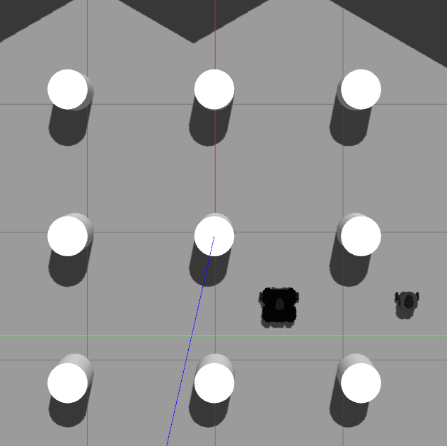

## Visualizing Multiple bots in Rviz

### Saving a new configuration

We would like to save a configuration beforehand that will enable us to view the bots and the laser scan data conveniently.

1. Change the **Fixed Frame** to ```odom```
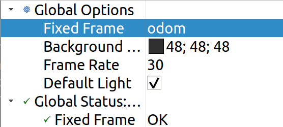

2. Change the angle to approximately -1.57 (this is optional)
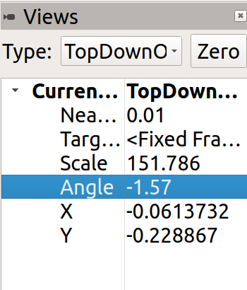

3. Add a **Robot Model** and rename it as **Sherlock**. Change the **Robot Description** to **sherlock/robot_description** and **TF Prefix** to **sherlock**
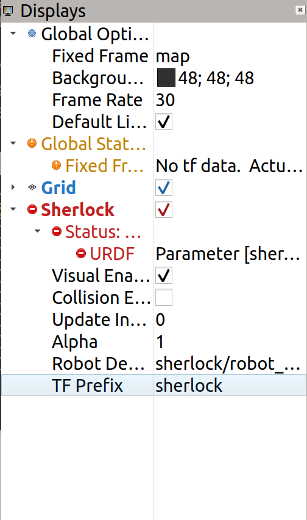

4. Similarly, add another **Robot Model** and rename it as **Watson**. Change the **Robot Description** to **watson/robot_description** and **TF Prefix** to **watson**
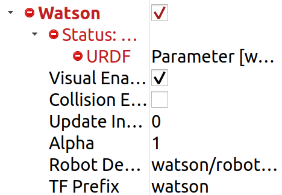

5. Add a **Laser Scan** and rename it as **Sherlock_Laser Scan**. Change the **Topic** to **sherlock/scan**
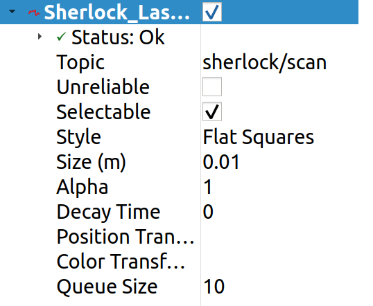

6. Add a **Laser Scan** and rename it as **Watson_Laser Scan**. Change the **Topic** to **watson/scan**
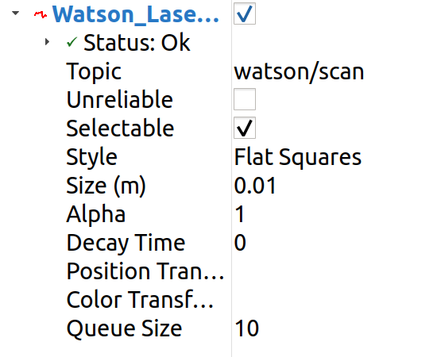

After making the above changes, save the configuration as ```2bots.rviz``` in the ```configs``` folder of ```epi1```

### Modified launch file

Adding  ``` <node name="rviz" pkg="rviz" type="rviz" args="-d $(find epi1)/configs/2bots.rviz"/>``` to the previous version of the launch file gives the required file

```xml
<launch>
  
  <include file="$(find gazebo_ros)/launch/empty_world.launch">
    <arg name="world_name" value="$(find turtlebot3_gazebo)/worlds/turtlebot3_world.world"/>
    <arg name="paused" value="false"/>
    <arg name="use_sim_time" value="true"/>
    <arg name="gui" value="true"/>
    <arg name="headless" value="false"/>
    <arg name="debug" value="false"/>
  </include>


  <group ns="sherlock">

    <arg name="model" default="waffle" doc="model type [burger, waffle, waffle_pi]"/>
    <arg name="x_pos" default="-0.5"/>
    <arg name="y_pos" default="-0.5"/>
    <arg name="z_pos" default="0.0"/>

    <param name="robot_description" command="$(find xacro)/xacro $(find turtlebot3_description)/urdf/turtlebot3_$(arg model).urdf.xacro " />

    <node pkg="gazebo_ros" type="spawn_model" name="spawn_urdf"  args="-urdf -model turtlebot3_$(arg model) -x $(arg x_pos) -y $(arg y_pos) -z $(arg z_pos) -param robot_description "  />

    <node name="joint_state_publisher" pkg="joint_state_publisher" type="joint_state_publisher" />

    <node pkg="robot_state_publisher" type="robot_state_publisher" name="robot_state_publisher">
      <param name="publish_frequency" type="double" value="50.0" />
      <param name="tf_prefix" value="sherlock"/>
    </node>

    <node pkg="tf" type="static_transform_publisher" name="sherlock_odom" args="0 0 0 0 0 0 1 odom sherlock/odom 100" />

  </group>


  
  <group ns="watson">

    <arg name="model" default="burger" doc="model type [burger, waffle, waffle_pi]"/>
    <arg name="x_pos" default="-0.5"/>
    <arg name="y_pos" default="-1.5"/>
    <arg name="z_pos" default="0.0"/>

    <param name="robot_description" command="$(find xacro)/xacro $(find turtlebot3_description)/urdf/turtlebot3_$(arg model).urdf.xacro " /> 

    <node pkg="gazebo_ros" type="spawn_model" name="spawn_urdf"  args="-urdf -model turtlebot3_$(arg model) -x $(arg x_pos) -y $(arg y_pos) -z $(arg z_pos) -param robot_description" />

    <node name="joint_state_publisher" pkg="joint_state_publisher" type="joint_state_publisher" />

    <node pkg="robot_state_publisher" type="robot_state_publisher" name="robot_state_publisher">
      <param name="publish_frequency" type="double" value="50.0" />
      <param name="tf_prefix" value="watson"/>
    </node>

    <node pkg="tf" type="static_transform_publisher" name="watson_odom" args="0 0 0 0 0 0 1 odom watson/odom 100" />

  </group>

  <node name="rviz" pkg="rviz" type="rviz" args="-d $(find epi1)/configs/2bots.rviz"/>
  

</launch>
```

On executing ```roslaunch epi1 2bots.launch```, you should be able to see the Sherlock and Watson bots beside each other in Rviz as well. Lovely!

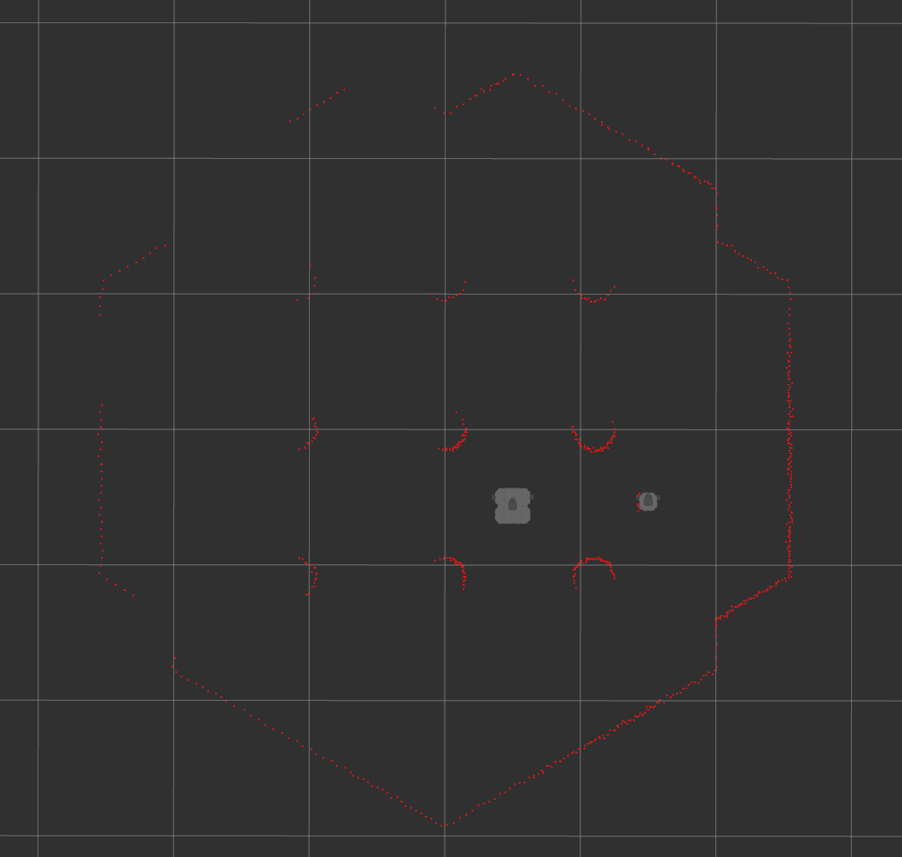

## Way ahead

Now that you have gained the ability to write code to move the bot around and sense the surroundings, what you can do with the bot is restricted only by your imagination. 

To know more about the TurtleBot3 and explore it various capabilities like navigation and SLAM, refer to the link below

[TurtleBot3](https://emanual.robotis.com/docs/en/platform/turtlebot3/overview/)

Additionally, one can try writing code for publishers and subscribers in different ways apart from the prescribed style, such as using **classes**. We shall leave that up to you for exploration. Have fun.

# Let's play a game, shall we ... 

**Sherlock** and **Watson** are trapped in a room and there doesn't seem to be a way out unless the code to escape the room is figured out. They need to **explore the room autonomously** and find clues which will help them determine the code. As they explore, they should make sure to **avoid colliding with objects** around them. You, the observer will be able to view the bots and what they detect through **Rviz** only.

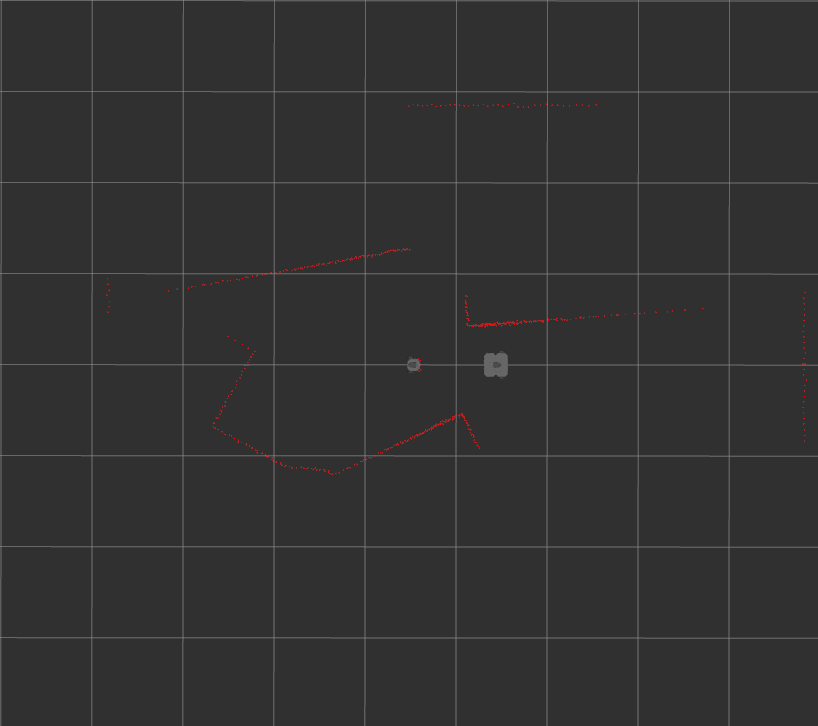

## Steps
1. Create a package ```task_1``` with ```scripts```,```launch```,```worlds``` and ```configs``` folders.
2. Download the ```arena.world```,```escape.launch```, ```observe.rviz``` and add them to the ```worlds```,```launch``` and ```configs``` folder respectively.
3. Create a node file ```bot_avoidance.py``` in the ```scripts``` folder of ```task_1``` package, which will be responsible for **obstacle avoidance and exploration** of the room. Both Sherlock and Watson will be operated using the same script.
4. Launch ```escape.launch```
5. The bots will begin exploring the room while avoiding obstacles. In this process, clues will be uncovered which you can observe and infer from.
6. From the inferences, determine the code.
7. Type the code in the terminal. If correct, ...

**Note** - Start with a simple algorithm for avoiding obstacles. A simple implementation might not be perfect in avoiding all kinds of obstacles since the obstacles can be all shapes and orientations. Experiment, test in different environments like ```wall.world``` and improve upon the algorithm over time.

Have fun!

