# Episode 2 - The Sign of ArUcos


So till now you have learnt how to control our bot and guide it through the maze using your keyboard. But when we are thinking about challenging Moriarty, we can't take any chances! We have to ensure that the bot is able to navigate it's own way through the maze using some clues present at each nodes of the maze. Holmes has deduced the nature of the clues that would be present. According to him, they would be of the form of markers known as ArUco markers. We need to train our bot to identify and process these. But before that, what exactly are this 'ArUco markers'? Let's find out...


## ArUco Markers
ArUco marker is a grid of black and white squares, typically a 5x5 grid, which looks something like this:


ArUco markers are used to for camera pose estimation, or calibration of the bot. In an ArUco marker, black box represents the number 0 and white box represents the number 1. So going by this, let us breakdown the above marker into grid. Also note that ArUco markers have a black border(padding) of 1 unit around them to make their detection easier, so that is neglected below.


Here the second and fourth column are the data bits, and the rest three are parity bits. Parity bits are usually used as a error detection and in this case they also help out in figuring out the orientation of the marker. The Parity1 and Parity3 are even parity bits and Parity2 is odd parity bit. You may read more about parity bits [here](https://en.wikipedia.org/wiki/Parity_bit). Below is the order according to which they are calculated.


It's fine if you don't understand what parity bits are, as that part is taken care by the computer.

Finally, coming back to data bits(read them horizontally), the above grid displays the binary number 1010001010, which is 650 in decimal representation.

Let’s see whether you have understood the above info, find out what number does the below ArUco marker represent.(Remember, the second and fourth columns are data bits.) You can also cross-check whether the parity bits are proper or not.


*Answer: The number represented by the bits is 100(in decimal)*

Alright, so now we understand what ArUco markers are, we need to find a way so that they are read by the bot through a camera fitted on it. This can be achieved through OpenCV.

## OpenCV


OpenCV (Open-Source Computer Vision Library) is an open-source library that includes several hundreds of computer vision algorithms. It helps us in performing various operations on images very easily.

In our task we will be mainly using ArUco, an OpenCV based library for detecting the markers and navigating through the maze. Nevertheless, some basic knowledge of OpenCV might be very useful for some of your future projects in Gazebo and Rviz.

### Installation and Setup

**Note:** Ubuntu has two python versions Python 2 and Python 3, you can see exact version of them by running ```python``` and ```python3``` in Terminal respectively. ROS (upto Melodic) officially supports only python 2 and NOT python 3. ROS Noetic target Python 3 exclusively. 

Most of you are using ROS Noetic, so we will focus on that only. ROS Melodic users will have to change 'python3' to 'python' in the ```#!/usr/bin/env python3``` in the first line of .py files they are using. 

#### Installing OpenCV </br>
  
 Execute 
 ```bash
 pip --version
 ```
 Ensure that pip is configured with python3.xx . If not you may have to use (```pip2 --version``` or ```pip3 --version```).
If it shwos 'ImportError: No module named pip' or similar error, you need to install pip by executing
 ```bash
 pip install pip
 ```
Execute
```bash
pip install opencv-contrib-python
pip install opencv-python
sudo apt-get install python-opencv
```
Use ```pip2``` or ```pip3``` in the above commands, if python3 is configured with one of them.

Type ```python3``` in Terminal to start Python interactive session and type following codes there.
```bash
import cv2 as cv
print(cv.__version__)
```
If the results are printed out without any errors, congratulations !!! You have installed OpenCV-Python successfully.

You may Install OpenCV from source. (Lengthy process)

Please refer to this [link](https://docs.opencv.org/4.5.0/d2/de6/tutorial_py_setup_in_ubuntu.html). This installation can take some time so have patience.

#### Setting up VS code
  
```bash
cd ~/catkin_ws/src
git clone https://github.com/kaushaljadhav512/opencv_tutorials
```
Launch VSC and in the explorer’s tab open the newly created folder (opencv_tutorials) and create a .py file to write your practice code.
Open the Extensions tab on the left side of your screen. Search and install the python extension.

Congrats! Now we are all set and can start with learning OpenCV!

### Module 1: Basic Commands

*	#### Importing the cv2 library </br>
    
    We import OpenCV with the following command: ```import cv2``` </br>
    We also include some other packages which we might be using soon.
    ```import numpy as np```
  
*	#### Reading a saved image on your device </br>

    This method loads an image from the specified file as a NumPy array with each cell as a pixel. </br>
    _Syntax_ – ```cv2.imread( path ,  flag )``` </br>
    _Parameters_ - </br>
    **path:** A string representing the path of the image to be read. </br>
    **flag (optional):** It specifies the way in which image should be read. It’s default value is ```cv2.IMREAD_COLOR```.</br>
    Refer [here](https://docs.opencv.org/3.4/d8/d6a/group__imgcodecs__flags.html) for more details.

* #### Displaying an image </br>
    
    Displays the image in a new GUI window.</br>
    _Syntax_ – ```cv2.imshow( window_name, code )``` </br>
    _Parameters_ – </br>
    **window_name:** A string representing the name of the window in which image to be displayed. This will be displayed on the Title Bar of the window. </br>
    **image:** It is the image that is to be displayed. (or rather the numpy array to be displayed)

* #### Converting colour spaces </br>
    
    This method is used to convert an image from one colour space to another. </br>
    If you are unfamiliar with colour spaces, just remember… colour spaces are specific organization of colours. </br>
    Example:  </br>
      **Grayscale:** uses shades of grey to represent intensity </br>
      **BGR:** stores individual values of Red Green Blue and an alpha channel to show transparency </br>
      **HSV (Hue, saturation, value):** an alternate form of RGB colour space that is similar to human vision perception and helpful for image identification. </br>

    <p align="center"> 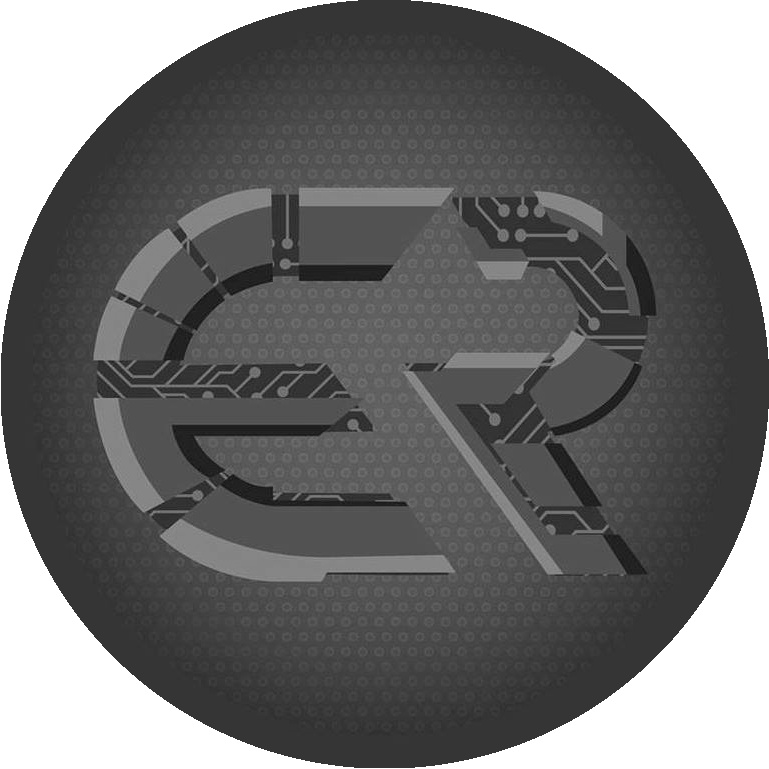 &nbsp; &nbsp; 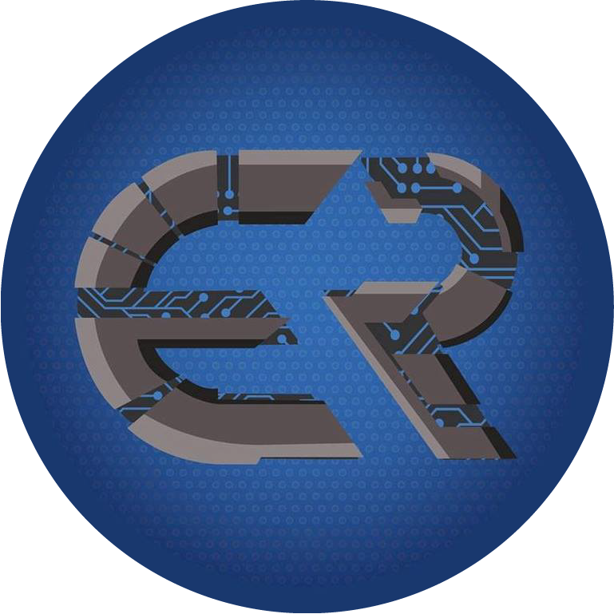 &nbsp; &nbsp;  </p> </br>
    
    _Syntax_ - ```cv2.cvtColor( source , conversion_code)``` </br>
    _Parameters_ - </br>
    **source:** the image to be converted, a numpy array. </br>
    **conversion_code:** It follows the pattern sourceCode2destinationCode </br>
    The full list of codes and its corresponding details can be found by following this [link](https://docs.opencv.org/master/d8/d01/group__imgproc__color__conversions.html).</br>

    If this is slightly confusing, don’t worry most of the times we only use the above three mentioned spaces.
  
 * #### Saving an image
    
    Saves the image (numpy array) in the local directory.</br>
    _Syntax_- ```cv2.imwrite( filename , image )``` </br>
    _Parameters_- </br>
    **filename:** A string representing the file name. The filename must include image format like .jpg, .png, etc. </br>
    **image:**  It is the image array that is to be saved. </br>
    
    _**Caution:** Before saving the file using this command, make sure that the image is in BGR format or you might get an unexpected error._

 * #### Destroying created GUI windows
    
    _Syntax_- ```cv2.destroyAllWindows()``` </br>
    Destroys all opened windows </br>
    
    _Syntax_- ```cv2.destroyWindow(name)``` </br>
    _Parameters_- </br>
    **name:** name of the window </br>
    Only destroys specified name window
    
 * ####	The Wait-Key function
    
    _Syntax_- ```cv2.waitKey(delay)``` </br>
    _Parameters_ - </br>
    **delay:** Delay in milliseconds. 0 is the special value that means infinitely. </br>
    Returns ASCII value of key pressed (32 bit integer)

    _**Some side note:** </br>
    If you've used ASCII you might wonder how ASCII (8 bit) can be compared with 32 bit integer. </br>
    Since you use only the last 8 bits from the 32 bits, we do a bitwise AND operation (&). </br>
    Let's see an example with this in action_
    ```python
    if cv2.waitKey(0) & 0xFF == ord('q'):
        # Perform action here
    ```
    _Here we extract the last 8 bits using the & operation and then compare it with the ASCII value of q. </br>
    The ```ord()``` python function returns an integer representing the Unicode character. </br>_
    
    _If you are still confused, do checkout [this answer](https://stackoverflow.com/questions/35372700/whats-0xff-for-in-cv2-waitkey1) on stackoverflow._

### Let us see an example which implements all of the above basic commands that we learned

```python
  # importing the cv library
import cv2
  
  # reading the image from path _____ and saving it in the form of a numpy array of name img 
img = cv2.imread('images_for_cv2/img.jpg')

  # changing the color space from BGR to GRAY and saving it in a new array variable called gray
gray = cv2.cvtColor(img, cv2.COLOR_BGR2GRAY)

  # saving the gray array as gray_img.jpg
cv2.imwrite('gray_img.jpg', gray)

  # Displaying the gray scaled image in a window named gray_img
cv2.imshow('gray_img', gray)

  # destroys all windows if the key ‘s’ is pressed
if cv2.waitKey(0) & 0xFF==ord('s'):
  cv2.destroyAllWindows()
```  

      
**Note:** The following 3 modules are not explicitly used in this workshop and are thus a part of Optional Learning.
 
### Module 2: Drawing and Texting on Images

  * ####	Creating a blank image by using a zero array from numpy
    
    _Syntax_ - ```name = np.zeros((height, width, no. of colour channels), dtype='uint8')``` </br>
    The data type ‘uint8’ means 8bit unsigned integer which ranges from 0 to 255. </br>
    _Example_ - 
    ```python
    blank = np.zeros((500,500,3), dtype='uint8')
    
    ```
  * ####	Painting the image a certain colour

    _Syntax_ - ```name[ y1 : y2 , x1 : x2 ] = B,G,R```    
    _Example_ -  
    ```python
    #creates a green rectangle ranging from height 200 to 300 and width 300 to 400.
    blank[200:300, 300:400] = 0,255,0
    
    ```
  * #### 	Drawing shapes on images

    1) Rectangle: 
        
        _Syntax_ - ```cv2.rectangle(image to draw on, from where, to where, colour, thickness of borders)``` </br>
        _Example_ - 
        ```python
        cv2.rectangle(blank, (0,0), (100,100), (0,255,0), thickness=-1)
        ```
        Using ‘```thickness=-1```’ shape fills the rectangle.
    
    2) Circle:
        
        _Syntax_ - ```cv2.circle(image to draw on, centre(x,y), radius, colour(B,G,R), thickness)``` </br>

    3) Line:
        
        _Syntax_ – ```cv2.line(image to draw on, starting point(x,y), ending point(x,y), colour(B,G,R), thickness)``` </br>

    4) Text:
        
        _Syntax_ – ```cv2.putTEXT(image to draw on, string, destination point, font, font size, colour, thickness)``` </br>
        _Example_ - 
        ```python
        cv.putTEXT(blank, 'Hello', (255,255), cv.FONT_HERSHEY_TRIPLEX, 1.0, (0,255,0), 2)
        
        ```
  
  * ####   Practice problems:

    1)	Using the functions that we learned in this module, recreate this iconic ```wallpaper_modified.jpg``` by drawing on ```wallpaper.jpg```.
    
    <p align="center"> 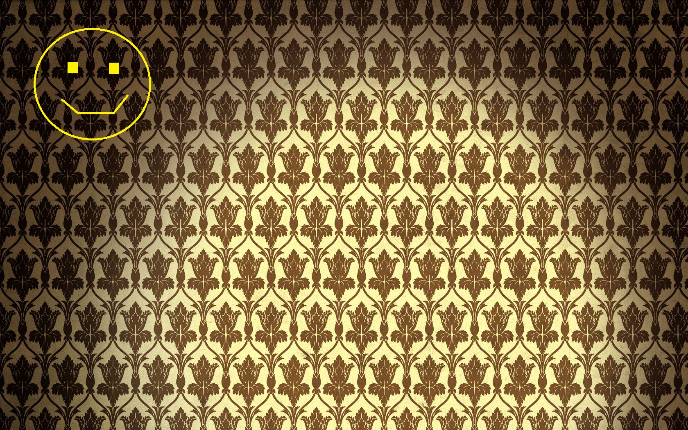 </p>
    
    2)	Help Sherlock unlock Adler’s phone by using the ```putTEXT``` command over the textboxes. I hope you already know the password

    <p align="center"> 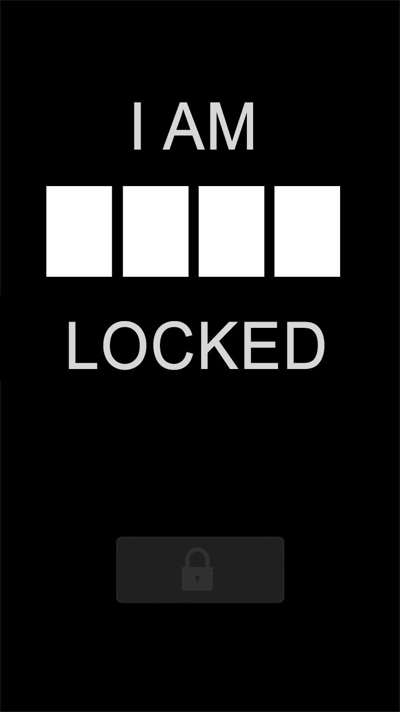 </p> 

### Module 3: Arithmetic Operations on Images
  
  * ####	Addition of Images:
      
      Two images can be added pixel by pixel (or rather element by element of their numpy arrays) if they are of the same size. </br>
      
      _Syntax_: ```cv2.add( img1 , img2 )``` </br>
      _Parameters_: **img1** and **img2** are the two images to be added. </br>
      _Example code_:
      
      ```python
      # importing the necessary libraries
      import cv2 
      import numpy as np 

      # reading the two images to be added 
      # in variables image1 and image2
      image1 = cv2.imread('images_for_cv2/add1.jpg') 
      image2 = cv2.imread('images_for_cv2/add2.jpg')

      # adding image1 and image2 and saving 
      # them in variable Sum_of_images

      Sum_of_images = cv2.add(image1, image2)

      # displaying the sum
      cv2.imshow('Sum_of_images', Sum_of_images)

      # exiting windows on press of ‘s’ key
      if cv2.waitKey(0) & 0xff == ord('s'): 
          cv2.destroyAllWindows()  
      ```

  * ####	Weighted Addition of Images:

      This function is just a modification to the addition function that might be helpful in some cases. </br>
      
      _Syntax_: ```cv2.addWeighted( img_1 , alpha , img_2 , beta , gamma)``` </br>
      _Parameters_: </br>
      **img_1, img_2:** the images to be added </br>
      **alpha, beta:** float values ranging from 0 to 1 that represent the weight of each image in the final image. </br>
      **gamma:** Scalar added to each sum. It is set to 0 for most practical purposes. (A bit beyond the scope of this documentation for now). </br>
      
      Also remember, alpha + beta = 1 always. </br>
      Thus, added_image = (img_1)*alpha + (img_2)*beta + gamma

  * ####	Subtraction of Images:
      
      _Syntax_: ```cv2.subtract( img1, img2)``` </br>
      _Parameters_: **img1** and **img2** are the two images to be subtracted. </br>
      _Example code_:
      
      ```python
      # importing the necessary libraries
      import cv2 
      import numpy as np 

      # reading the two images to be subtracted
      # in variables image1 and image2
      image1 = cv2.imread('images_for_cv2/sub1.jpg') 
      image2 = cv2.imread('images_for_cv2/sub2.jpg')

      # subtracting image2 from image1 and saving 
      # them in variable Diff_of_images

      Diff_of_images = cv2.subtract(image1, image2)

      # displaying the difference
      cv2.imshow('Diff_of_images', Diff_of_images)

      # exiting windows on press of ‘s’ key
      if cv2.waitKey(0) & 0xff == ord('s'):
        cv2.destroyAllWindows()

      ```
	### Module 4: Bitwise Operations on Images
	  
	  To better understand this module, we need the two images (yinyang_square and yinyang_circle) uploaded in the ```images_for_cv2``` folder. </br>
	  Just as when we performed arithmetic operations, in bitwise operations the images should be of the same pixel size. </br>
	  
	  Let us first read and observe these two images: </br>
	  
	  ```python
	  import cv2
	
	  img1 = cv2.imread('images_for_cv2/yinyang_square.jpg')
	  img2 = cv2.imread('images_for_cv2/yinyang_circle.jpg')
	  cv2.imshow('yinyang_square', img1)
	  cv2.imshow('yinyang_circle', img2)
	  if cv2.waitKey(0) & 0xff == ord('s'):
	    cv2.destroyAllWindows()
	  ```
	  <p align="center"> 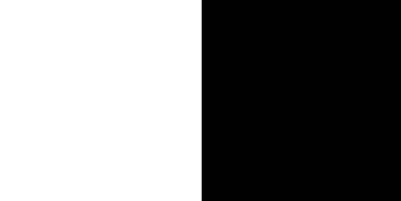 &nbsp; &nbsp; &nbsp; &nbsp; &nbsp; &nbsp; 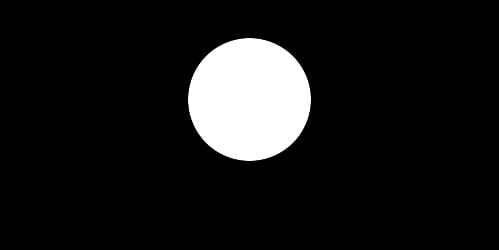 </p>
	  
	  Now we are ready to operate on these two images. </br>
	  The syntax and the usage for all of these functions is pretty intuitive and easy to interpret. But do give each of them a try and see the results for yourself. </br>
	  
	  * ####	AND Operation (Conjunction)
	      
	      _Syntax_ - ```cv2.bitwise_and( img1 , img2 )``` </br>
	      _Parameters_ – *img1, img2:* the two images to be conjuncted
	      
	  * ####	OR Operation (Disjunction)
	      
	      _Syntax_ - ```cv2.bitwise_or( img1 , img2 )``` </br>
	      _Parameters_ – *img1, img2:* the two images to be disjuncted
	      
	  * ####	XOR Operation
	      
	      _Syntax_ - ```cv2.bitwise_xor( img1 , img2 )``` </br>
	      _Parameters_ – *img1, img2:* the two images to be XORed
	      
	  * ####	NOT Operation (Complement)
	      
	      _Syntax_ - ```cv2.bitwise_not( img )``` </br>
	      _Parameters_ – *img:* the image to be complemented
	 
	 ### Moving forward with OpenCV
	  
	  
	  
	  You might be wondering the practical applications of using Arithmetic and Bitwise Operations on images. But they have a very specific use in watermarks and logos. Do check out the [official documentation](https://docs.opencv.org/4.x/d0/d86/tutorial_py_image_arithmetics.html) of OpenCV to gain some insights on this.
	  
	  **This covers our brief introduction to OpenCV.** </br>
	  If you are interested further, we do recommend to explore ```Image Processing```.
	  
	  #### Link to the official python-tutorials: 
	  https://docs.opencv.org/4.x/d2/d96/tutorial_py_table_of_contents_imgproc.html
	  
	  #### geeksforgeeks also provides some amazing tutorials on OpenCV: 
	  https://www.geeksforgeeks.org/opencv-python-tutorial/#images
	  
	  #### Some really cool tutorials on OpenCV that we found on Youtube: 
	  https://www.youtube.com/watch?v=oXlwWbU8l2o&t=7032s </br>
	  https://www.youtube.com/watch?v=01sAkU_NvOY&t=109s


## Libraries for ArUco Markers 

Since now you have a basic idea of OpenCV, let us see, how can we use it to detect ArUcos. By detecting, here our objective is to detect the position of the corners of the marker and ID of the marker(this is different from the data bits number, read on to find out). We will use the python library - ArUcos. In the header of your python script, add the following libraries:

```python
import numpy as np
import math
import cv2
import cv2.aruco as aruco
```
`aruco` library has predefined dictionaries of markers, which it uses to detect the given markers. We have to create an instance of these dictionaries before we proceed. It is done using:

```python
aruco_dict = aruco.Dictionary_get(aruco.DICT_5x5_250)
```
_If due to some reason, you are getting an error in the above line of code, you can replace it by:_
```python
aruco_dict = aruco.Dictionary_get(getattr(aruco, f'DICT_{5}X{5}_{250}'))
```
Moving on, this is an example of a dictionary of 250 ArUco markers of size 5x5. 

Let us say the image we have got from the camera is stored in the variable `img`. (We will discuss how to get the image from camera in ROS later) \
Also remember that it is okay to have more than one ArUco markers in an image.

Ok, so now lets convert this image into grayscale image and store it into another variable `gray`.
```python
gray = cv2.cvtColor(img, cv2.COLOR_BGR2GRAY)
```
Next we create an instance of a class, which includes all the options that can be customized during the marker detection process:
```python
Parameters = aruco.DetectorParameters_create()
```
And finally, we unpack parameters of the marker through:

```python
corners, ids, _ = aruco.detectMarkers(gray, aruco_dict, parameters = Parameters)
```
Note that we have used " _ " above because there is a third parameter which is returned above and we aren't interested in it.

So let us see what are the arguments:
- gray : Grayscale image of the sample to be detected.
- aruco_dict : The dictionary of which the ArUco marker is a part of.
- Parameters : This is the object returned by the aruco.DetectorParameters_create()

What this returns is:
- ids : This is a list, which contains the ArUco id according to the dictionary; if there are N markers in the image, then size of the list is N.
- corners : This is a numpy array of the 2D coordinates of the corners of the markers. For each marker, the four corners are returned in their _**original**_ order, i.e. clockwise starting from top right(This info will come handy later, remember it). If there are N markers in the image, then the size of the array(i.e. _corners_) is Nx4.

## cv_bridge

Now that we are familiar with the basics of OpenCV, ArUco and ROS, we can finally talk about integrating these two and performing various operations on images such as image detection.</br>

Unfortunately, in ROS, the format of the images being processed (ROS image Message) is quite different than that used in OpenCV (cv::Mat). This is where the library  cv_bridge comes to the rescue! </br>
We create a publisher-subscriber model to import and export images out of ROS into OpenCV and back into ROS. 


### Let us start with a simple example.
Suppose, we are getting Image data on ```/camera/rgb/image_raw``` topic. 
Here is a node that listens to a ROS image message topic, converts the images into an cv::Mat, displays the image using OpenCV. 

```python
#!/usr/bin/env python3
  
import rospy
from sensor_msgs.msg import Image
import cv2
from cv_bridge import CvBridge, CvBridgeError


def callback(img_msg):
    # Initialize the CvBridge class
    bridge = CvBridge()
    # Print some info of image to the Terminal and to a ROS Log file located in ~/.ros/log/loghash/*.log
    rospy.loginfo(img_msg.header)

    # Try to convert the ROS Image message to a CV2 Image
    try:
        cv_image = bridge.imgmsg_to_cv2(img_msg, "passthrough")
    except CvBridgeError as e:
        rospy.logerr("CvBridge Error: {0}".format(e))

    # Convert the image to Grayscale
    gray = cv2.cvtColor(cv_image, cv2.COLOR_BGR2GRAY)
    # Show the converted image
    cv2.namedWindow("Image Window", 1)
    cv2.imshow("Image Window", gray)
    cv2.waitKey(3)


def laser():
    rospy.Subscriber('/camera/rgb/image_raw', Image, callback)
    rospy.spin()


if __name__ == '__main__':
    rospy.init_node('cvbridge_example', anonymous=True)
    try:
        laser()

    except rospy.ROSInterruptException:
        pass
```


## Proceeding to detect ArUco..

Open the Terminal and run following commands-
```bash
cd ~/catkin_ws/src
git clone https://github.com/Tejas2910/aruco_detection/tree/python3_noetic
cd ~/catkin_ws
catkin_make
```
Now you have a package aruco_detection, let's run it.
```bash
roslaunch aruco_detection maze_aruco.launch
```
Let's spawn the Turtlebot3 by running following command in another tab
```bash
roslaunch aruco_detection spawn_turtlebot3.launch
```
You can see ArUco marker in front of TurtleBot3(waffle_pi model).
Why we used waffle_pi ? Guess... Remember Investigation 1 of Episode 1. 

Yes, you guessed correctly. Let's check by executing ``` rostopic list ``` in another tab.
```bash
/clock
/cmd_vel
/gazebo/link_states
/gazebo/model_states
/gazebo/parameter_descriptions
/gazebo/parameter_updates
/gazebo/set_link_state
/gazebo/set_model_state
/imu
/joint_states
/odom
/rosout
/rosout_agg
/scan
/tf
/turtlebot3_waffle_pi/camera/camera_info
/turtlebot3_waffle_pi/camera/image_raw
/turtlebot3_waffle_pi/camera/image_raw/compressed
/turtlebot3_waffle_pi/camera/image_raw/compressed/parameter_descriptions
/turtlebot3_waffle_pi/camera/image_raw/compressed/parameter_updates
/turtlebot3_waffle_pi/camera/image_raw/compressedDepth
/turtlebot3_waffle_pi/camera/image_raw/compressedDepth/parameter_descriptions
/turtlebot3_waffle_pi/camera/image_raw/compressedDepth/parameter_updates
/turtlebot3_waffle_pi/camera/image_raw/theora
/turtlebot3_waffle_pi/camera/image_raw/theora/parameter_descriptions
/turtlebot3_waffle_pi/camera/image_raw/theora/parameter_updates
/turtlebot3_waffle_pi/camera/parameter_descriptions
/turtlebot3_waffle_pi/camera/parameter_updates
```
Camera Sensor is publishing data of ```sensor_msgs/Image``` msg type to ```/turtlebot3_waffle_pi/camera/image_raw``` topic. Let's visualize this data throgh **Rviz**.

Run ```rviz``` in Terminal. Click on Add button, Under tab **By topic** add ```/turtlebot3_waffle_pi/camera/image_raw``` topic. You can see data published on this topic.  

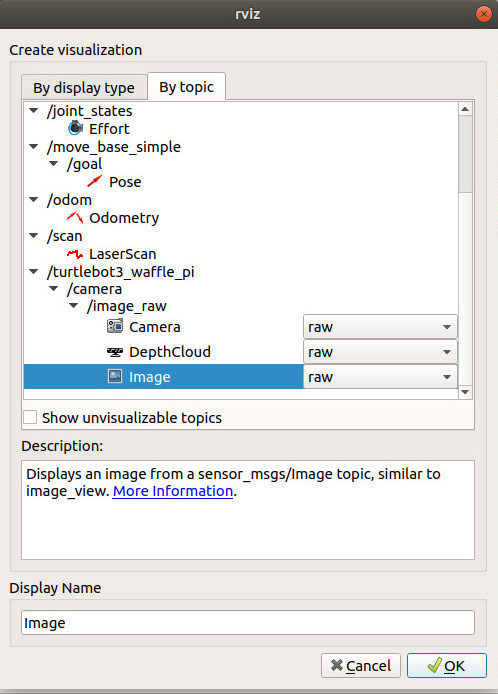

Now, we will subscribe ```/turtlebot3_waffle_pi/camera/image_raw``` topic to convert ROS Image data to OpenCV Image data using **cv_bridge**.

Execute the following command in another tab.
```bash
rosrun aruco_detection detect_marker.py
```
On executing You should be able to see following screen.

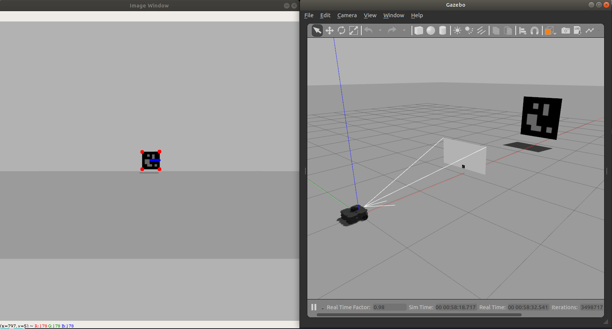

Have a look at the detect_marker.py file

```python
#!/usr/bin/env python3

from sensor_msgs.msg import Image
from cv_bridge import CvBridge, CvBridgeError
import cv2
import numpy as np
import rospy
import cv2.aruco as aruco
import sys
import math
import time

def detect_ArUco(img):
	## function to detect ArUco markers in the image using ArUco library
	## argument: img is the test image
	## return:   dictionary named Detected_ArUco_markers of the format {ArUco_id_no : corners},
	## 	     where ArUco_id_no indicates ArUco id and corners indicates the four corner position 
	##	     of the aruco(numpy array)
	##	     for instance, if there is an ArUco(0) in some orientation then, ArUco_list can be like
	## 				{0: array([[315, 163], [319, 263], [219, 267], [215,167]], dtype=float32)}
						
    Detected_ArUco_markers = {}
    gray = cv2.cvtColor(img, cv2.COLOR_BGR2GRAY)
    aruco_dict = aruco.Dictionary_get(aruco.DICT_5X5_250)
    parameters = aruco.DetectorParameters_create()
    corners, ids, _ = aruco.detectMarkers(gray, aruco_dict, parameters = parameters) 
    i = 0
    
    try:
        for id in ids:
            for id_Number in id:
                Detected_ArUco_markers[id_Number] = corners[i][0]    

    except TypeError:
        print("No aruco in front of me")

    i += 1
    return Detected_ArUco_markers


def mark_ArUco(img,Detected_ArUco_markers):
	## function to mark ArUco in the test image as per the instructions given in problem statement
	## arguments: img is the test image 
	##			  Detected_ArUco_markers is the dictionary returned by function detect_ArUco(img)
	## return: image helping sherlock to solve maze 

    ids = Detected_ArUco_markers.keys()
    print(Detected_ArUco_markers)
    centre_aruco = {}
    top_centre = {}

    try:
        for id in ids:
            corners = Detected_ArUco_markers[id]
            for i in range(0, 4):
                cv2.circle(img,(int(corners[i][0]), int(corners[i][1])), 5, (0,0,255), -1)
            centre_aruco[id] = (corners[0]+corners[1]+corners[2]+corners[3])/4
            top_centre[id] = (corners[0]+corners[1])/2
            cv2.line(img, (int(centre_aruco[id][0]), int(centre_aruco[id][1])),
	    		(int(top_centre[id][0]), int(top_centre[id][1])), (255, 0, 0), 5)

    except TypeError:
        print("No aruco in front of me")

    return img

def callback(img):
    bridge = CvBridge()
    try:
        cv_image = bridge.imgmsg_to_cv2(img, "bgr8")
    except CvBridgeError as e:
        rospy.logerr("CvBridge Error: {0}".format(e))
    Detected_ArUco_markers = detect_ArUco(cv_image)	  
    img = mark_ArUco(cv_image,Detected_ArUco_markers)    
    cv2.namedWindow("Image Window", 1)
    cv2.imshow("Image Window", img)
    k = cv2.waitKey(1)
    

def laser():
    rospy.Subscriber('/turtlebot3_waffle_pi/camera/image_raw', Image, callback)
    rospy.spin()


if __name__ == '__main__':
    rospy.init_node('detect_marker')
    try:
        laser()

    except rospy.ROSInterruptException:
        pass
	
```
Run ```roslaunch aruco_detection turtlebot3_teleop_key.launch``` in another window, and try to move the bot.

Now, we have seen ArUco detection,

# Let's Solve mAzE

At this stage, you have enough knowledge to escape from the maze created by Moriarty.

Open **maze_aruco.launch** file in launch folder and replace empty.world with maze_aruco.world. Required file is:

```xml
<launch>

  <include file="$(find gazebo_ros)/launch/empty_world.launch">
    <arg name="world_name" value="$(find aruco_detection)/worlds/maze_aruco.world"/>
    <arg name="paused" value="false"/>
    <arg name="use_sim_time" value="true"/>
    <arg name="gui" value="true"/>
    <arg name="headless" value="false"/>
    <arg name="debug" value="false"/>
  </include>

</launch>
```
Execute following command 
```bash
roslaunch aruco_detection maze_aruco.launch
roslaunch aruco_detection spawn_turtlebot3.launch
```
Upon execution, the following screen should be visible.

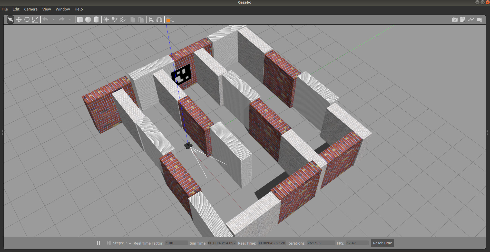

Cool !

How will you come out of this maze, which is surrounded by walls from all the sides ?

Well, it's Moriarty's maze.

There is a trick - Bot can go through some of the walls present in the maze. But, how will bot find those walls ? 

ArUco says hi!! 

ArUco will guide you along the way to solve the maze. 

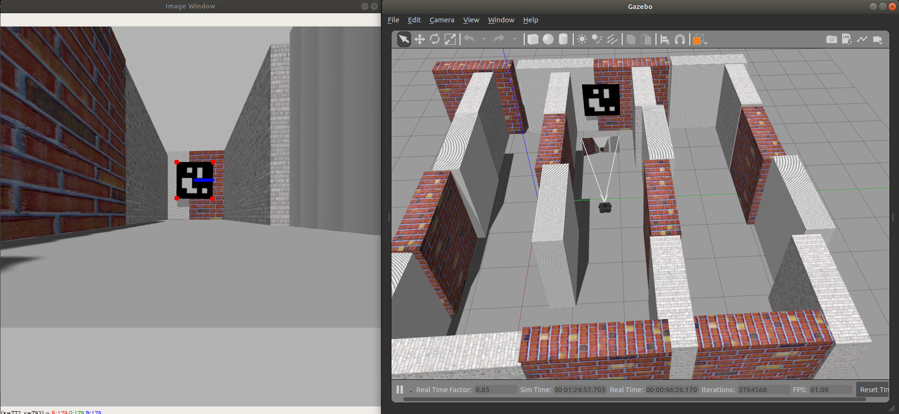

The **Blue line** in ArUco marker in "Image Window" is indicating that magic wall 

Execute ```rosrun aruco_detection detect_marker.py```. Open new terminal and execute ```roslaunch aruco_detection turtlebot3_teleop_key.launch``` to control bot.

If you are curious about how these walls are created, don't worry. We will go deeper into these things in coming week.

Now, go ahead and solve the maze. :)

### That's the end of Week 2! Cheers!

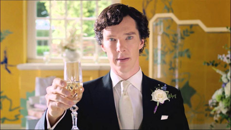

