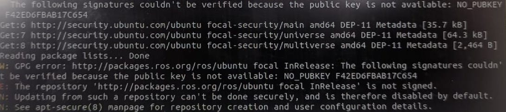
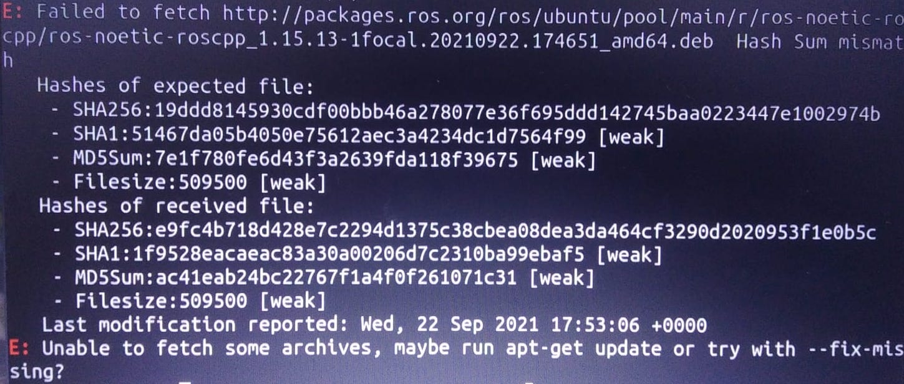

# Frequently Asked Questions

## Ubuntu Dual Boot -
**1.**  How much space you should give to Ubuntu while dual booting ? 

**Ans:** If you are dual booting Ubuntu only for this workshop, you can give around **100 GB** space. Allocate **30 GB** for **Root** ( / ), **8-10 GB** for **swap** area, remaining for **Home**. <br />
If you are planning to use Ubuntu furthur, dedicate **full D ( E or F )** drive to it ( **300 GB** in most of the cases ). Give **30 GB** for **Root**, **10 GB** for **swap** area, reamining for **Home**.

## ROS Installation

**1.**  I am getting the following error message after running ```sudo apt update```. What to do ?



**Ans:**  Refer to the methods in this [link]() and hopefully the issue should be resolved.

<br/>

**2.**  I am getting the following error message after running ```sudo apt install ros-noetic-desktop-full```. What to do ?



**Ans:**  Run ```sudo apt-get update``` and WAIT ! It takes time for this step to completely finish and it might seem like nothing is happening. Be patient.
