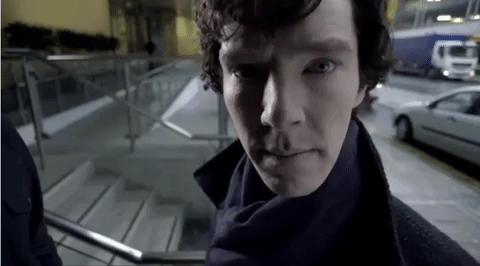

# A fROSty-Winter-2021

Hi! Welcome to a **fROSty Winter**.

Detective Sherlock Holmes's arch-nemesis Moriarty has escaped into the virtual world of simulations. He needs tech-savvy detectives with the knowledge of ROS, OpenCV, and Gazebo to catch Moriarty and end it once and for all.

## Objectives of this Workshop:
1. The objective of this workshop is to give you the basic tools and knowledge to be able to understand and create any basic ROS related project. You will be able to move robots, read their sensor data, make the robots perform intelligent tasks, see visual representations of complex data such as laser scans and debug errors in the programs.
2. This will allow you to understand the packages that others have done. So you can take ROS code made by others and understand what is happening and how to modify it for your own purposes
3. This can serve as an introduction to be able to understand the ROS documentation of complex ROS packages for object recognition, text to speech, navigation and all the other areas where ROS developed code.

You're going to learn a lot, and it's gonna be a hell a lot of fun.
Head on to [Episode 0](https://github.com/erciitb/frosty-winter-2021/blob/main/Episode%200%20-%20A%20Study%20in%20ROSe.md) and start the investigation! 

Let's begin !!
